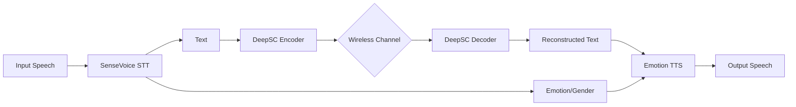

# 🎙️ Semantic Speech Communication Pipeline

An end-to-end semantic communication system that transmits speech over wireless channels using **DeepSC (Deep Semantic Communication)**. The system extracts not just the text, but also the **emotion** and **gender** of the speaker to reconstruct high-fidelity, expressive speech at the receiver.

 *(IIIT Allahabad Project)*

## 🌟 Key Features

- **Speech-to-Text (STT):** Uses FunASR's `SenseVoice-Small` for high-accuracy transcription and multi-lingual support.
- **Emotion & Gender Detection:** Automatically extracts emotional state and speaker gender to preserve prosody.
- **DeepSC (Transformer):** A deep semantic communication model trained on the Europarl dataset to compress and transmit meaning over noisy channels.
- **Wireless Channel Simulation:** Supports **AWGN**, **Rayleigh**, and **Rician** fading channels with adjustable SNR.
- **Emotion-Aware TTS:** Reconstructs speech using the `Kokoro` model via TTS.ai API, adjusting tone based on detected emotions.
- **Web Interface:** A sleek Gradio-based dashboard for real-time experimentation.

---

## 🏗️ System Architecture



---

## 🚀 Getting Started

### Prerequisites
- **Python 3.9+**
- **Conda** (recommended)
- **FFmpeg** (for audio processing)

### Installation
1.  **Clone the repository:**
    ```bash
    git clone <your-repo-url>
    cd "minor project"
    ```
2.  **Run the installation script:**
    ```bash
    ./install.bat
    ```
    *This will create a `speech_pipeline` conda environment and install all dependencies (PyTorch, FunASR, Gradio, etc.).*

3.  **Configure API Keys:**
    Create/Edit the `.env` file in the root directory:
    ```env
    TTS_API_KEY=your_tts_api_key_here
    TTS_API_BASE=https://api.tts.ai/v1
    TTS_MODEL=kokoro
    CHECKPOINT_DIR=./checkpoints
    VOCAB_PATH=./checkpoints/vocab.json
    ```

### Model Checkpoints
Ensure your trained `.pth` files and `vocab.json` are placed in the `checkpoints` directory:
- `checkpoints/vocab.json`
- `checkpoints/awgn/checkpoint_80.pth`
- `checkpoints/rayleigh/checkpoint_80.pth`
- `checkpoints/rician/checkpoint_80.pth`

---

## 🎮 Usage

Simply run the batch script to launch the web interface:
```bash
./run_ui.bat
```
Then open `http://127.0.0.1:7860` in your browser.

---

## 📊 Performance
The system is evaluated using **BLEU scores** to measure how well the semantic meaning is preserved across different Signal-to-Noise Ratios (SNR).

- **High SNR (>15dB):** Near-perfect reconstruction.
- **Low SNR (<5dB):** DeepSC outperforms traditional source/channel coding by maintaining the semantic context even when words are slightly altered.

---

## 👨‍💻 Contributors
- Developed as part of a Minor Project at **IIIT Allahabad**.

---

## 📜 License
This project is for academic purposes. DeepSC architecture is based on the research by *H. Xie et al.*
